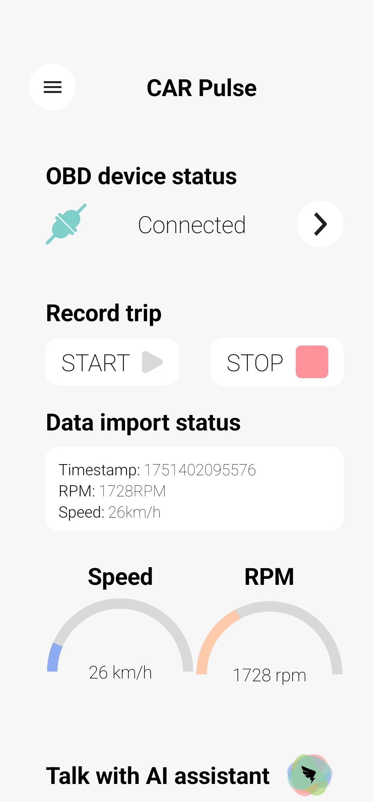
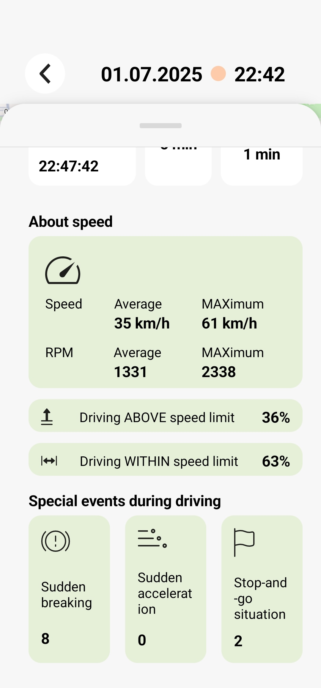
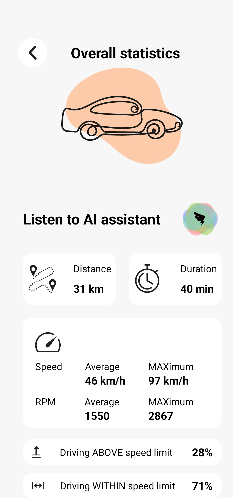

# CarPulse
A mobile application for collecting contextually enriched driving data via OBD-II protocol using ELM327 device.

## Installation
- Download the [APK](https://github.com/renatomajer/CarPulse/releases/download/v1.0.0/app-debug.apk)
- Transfer the file to your Android device
- Open the file to install the application

## Using the application
- Before launching the application, please make sure your Bluetooth and GPS adapters are turned ON, and you have a stable Internet connection.
- On the first launch, the app will request multiple permissions. It is necessary to allow the permissions for the app to function properly.
- Fill in the user data on the onboarding screens and proceed to main screen.
- Navigate to "Scan and connect" using the side menu on the Home screen of the application and connect to your OBD-II-to-Bluetooth microcontroller.
- Return to the main screen and start the measurement. 
- The application will display the collected data and send it to the assigned MQTT broker.

## Screenshots

  
  
  
  
  

